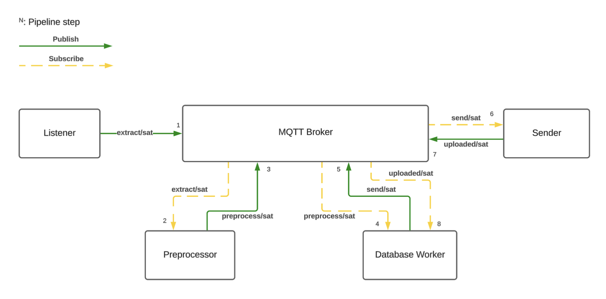

# Scorpio-Project

Scorpio pipeline with two runtime parts:

- Docker stack: `mqtt`, `data_ingest`, `data_preprocess`, `data_storage`, `data_clean`, `data_export`
- Decoder service: `lora-decoder@<user>.service`, which listens to LoRa and forwards messages into `data_ingest`

## Quick Start

```bash
make start
```

The last command will build the docker stack  and the systemd service for the LoRa decoder. 


### Alternatives (Manual)
The last command `make start` does not allow you to view real-time logs from all containers from the docker stack while the service is being compiled. If you want to view the logs during compilation, you can run the following command in a separate terminal:

```bash 
docker compose -f deploy/docker-compose.yml up --build
```

After the docker stack is up, you can start the LoRa decoder service manually:

```bash
bash decoder/install_decoders.sh
```


## Decoder

The LoRa decoder is the first input component of the flow. It listens to LoRa frames, decodes them, and publishes the resulting event to `data_ingest`, which then forwards it through the rest of the pipeline shown in the diagram.




The example transmitter is in [LoRaTx.ino](LoRaTx.ino). It generates a sample payload so you can test the full flow on an ESP32 board. The sketch is intended to be configurable for Heltec WiFi LoRa 32 (V3), Wireless Shell (V3), and Wireless Stick Lite (V3).

Use the Arduino IDE with RadioLib installed:

```cpp
#include <RadioLib.h>
```


## Useful Commands

Stop the stack keeping the volumes:

```bash
make stop
```
If you need to stop and remove all containers, volumes, and networks:

```bash
make delete-all
```

For more commands, execute the command `make help` to see the full list of available commands and their descriptions.

## Logs

Preview the logs of all services in real-time (docker stack)

```bash
make logs
```

Save them to a file (ordered by timestamp):

```bash
make save-logs
```

The result file will contain all logs from the services, and saved in the logs/ directory as *<timestamp>_all_containers.log*. 

Read Mosquitto’s file log:

```bash
docker compose -f deploy/docker-compose.yml exec mqtt sh -c 'tail -f /mosquitto/log/mosquitto.log'
```

## Data

Persistence uses Docker volumes: `mqtt_data`, `mqtt_log`, and `sqlite_data`.

### SQlite CLI
To access the SQLite database local_backup.db, you can use the following command:

```bash
make sqlite-shell
```

## Development

```bash
make setup-dev
make lint
```

If Docker access fails on Linux, add your user once:

```bash
sudo usermod -aG docker $USER
```

Then log out and back in.

## Server connection
You need an environment file (`.env`) to send packets to the Scorpio Server.

The server requires authentication, so you must first register a station on the website. Once the station is registered, the server will provide a **one-time key that allows you to send data**.

In this project, the `.env` file must be placed in the main directory.

```bash
SCORPIO_API_URL=<API_URL>
SCORPIO_STATION_KEY=<KEY>
```

For **local development**, the API URL should be:

```bash
SCORPIO_API_URL=http://api:3000/packets
```
