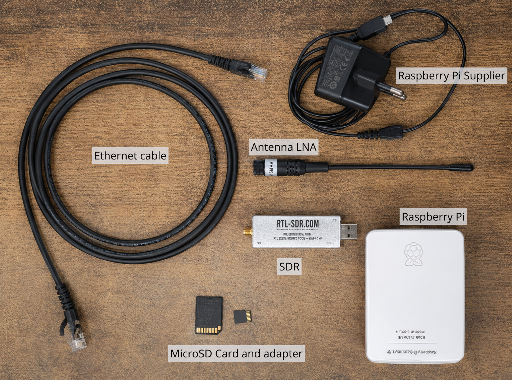
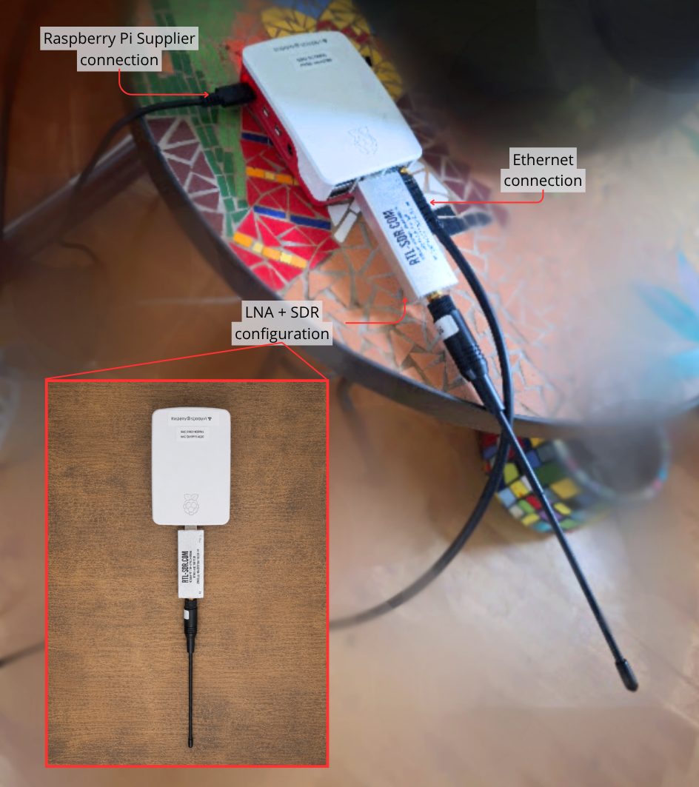

# 1. Hardware and Raspberry Pi preparation

[← Contents](README.md) | [Next: SSH and installation →](page2.md)

## Requirements

- Compatible Raspberry Pi and power supply.
- microSD card or SSD.
- Computer with [Raspberry Pi Imager](https://www.raspberrypi.com/software/).
- LNA antenna and SDR.

<figure>

<figcaption>Figure 1. Materials required for installation.</figcaption>
</figure>

See Raspberry Pi’s official [Getting Started guide](https://www.raspberrypi.com/documentation/computers/getting-started.html) for the physical setup.

## Configure Raspberry Pi OS, Wi-Fi, and SSH

In Raspberry Pi Imager1, select the model, install **Raspberry Pi OS (64-bit)**, and choose the microSD card or SSD. In advanced settings:

1. Set the hostname, for example, `scorpio`.
2. Configure the location and time zone.
3. Create the user and password for SSH.
4. Configure the Wi-Fi SSID and password.
5. Enable SSH with password authentication.

Click **Write**, safely remove the drive, insert it into the Raspberry Pi, and power it on.

1 Follow Raspberry Pi’s official guide to [install Raspberry Pi Imager](https://www.raspberrypi.com/documentation/computers/getting-started.html#imager-install) and prepare the boot media.

## Final assembly

Connect the Raspberry Pi to the local network over Ethernet and connect the LNA antenna to the SDR.

<figure>

<figcaption>Figure 2. Final physical infrastructure setup.</figcaption>
</figure>
