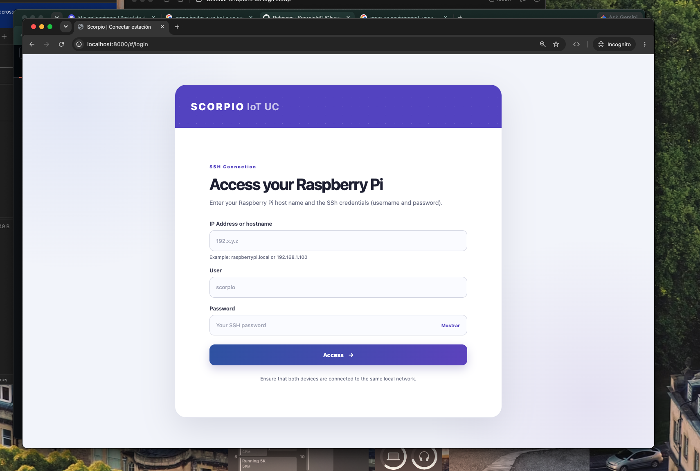
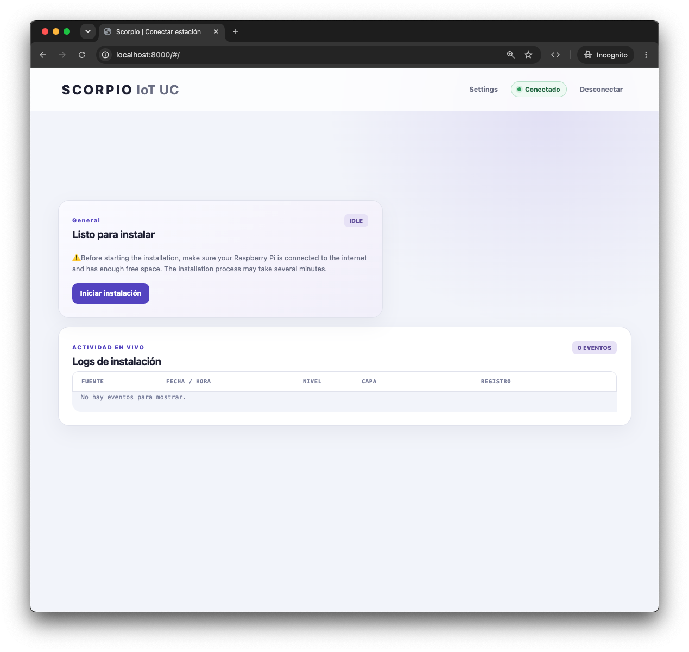
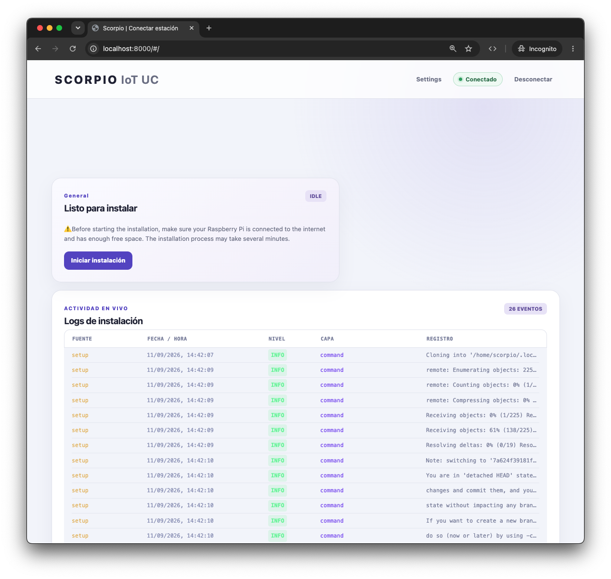
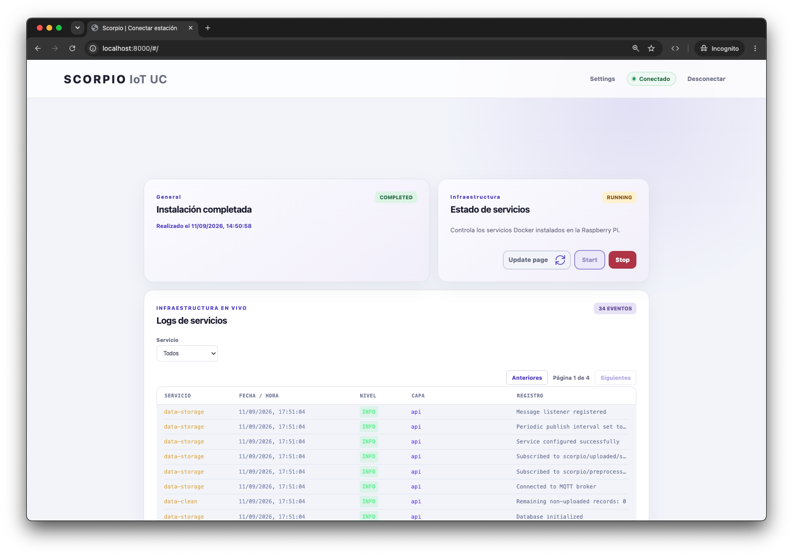

# 2. Installing Scorpio

[← Previous: local access](page1.md) | [Contents](README.md) | [Next: Tailscale →](page3.md)

> ⚠️ The local web interface is still under development. If you find an error, report it in [Issues](https://github.com/ScorpioIoTUC/Scorpio-Project/issues).

Scorpio can be installed through the web interface—the recommended option—or directly from the Raspberry Pi terminal.

## Option A: install through the web interface (recommended)

With this method, install Scorpio CLI on the computer used to administer the Raspberry Pi. The UI connects over SSH and runs the installation on the remote device.

### 1. Install Scorpio CLI

On macOS, create a virtual environment and install Scorpio CLI with `pip` or `pip3`:

```bash
python3 -m venv .venv
source .venv/bin/activate
pip install scorpio-cli
# You can also use: pip3 install scorpio-cli
```

On Linux, install `pipx` with your distribution's package manager:

```bash
sudo apt update
sudo apt install -y pipx
pipx ensurepath
pipx install scorpio-cli
```

On Windows PowerShell:

```powershell
py -m venv .venv
.\.venv\Scripts\Activate.ps1
python -m pip install scorpio-cli
```

If Scorpio CLI is already installed, upgrade it using the same installation method:

```bash
# macOS or a virtual environment
pip install --upgrade scorpio-cli
# You can also use: pip3 install --upgrade scorpio-cli

# Linux with pipx
pipx upgrade scorpio-cli
```

### 2. Open the UI and sign in

Run:

```bash
scorpio ui
```

The terminal will display:

```text
INFO:root:Server started at http://localhost:8000
```

Open [http://localhost:8000](http://localhost:8000) and enter the Raspberry Pi hostname or IP address, SSH username, and password. Both devices must be reachable through the same network or Tailscale.

<figure>

<figcaption>Figure 1. Signing in to the Raspberry Pi over SSH.</figcaption>
</figure>

### 3. Start the installation

After connecting, the installation panel appears. Make sure the Raspberry Pi has Internet access and enough free space, then click **Iniciar instalación**.

<figure>

<figcaption>Figure 2. Installation panel ready to start.</figcaption>
</figure>

The UI downloads the latest Scorpio-Project release, installs the host dependencies, and prepares the Docker infrastructure. The process can take several minutes and produces many logs.

<figure>

<figcaption>Figure 3. Real-time installation progress and logs.</figcaption>
</figure>

Monitor the logs during installation. If a problem occurs, the status changes to **Failed**, and the latest record identifies the cause. When the process finishes successfully, the status changes to **Completed**.

### 4. Restart and manage services

After installation completes, we recommend using the **Reiniciar Raspberry Pi** button. The connection closes temporarily; wait a few minutes and sign in again when the device is available.

The UI displays the infrastructure status, service logs, and **Start** and **Stop** controls. Use **Update page** to query the current status and reconnect the logs when necessary.

<figure>

<figcaption>Figure 4. Infrastructure controls and service logs.</figcaption>
</figure>

## Option B: install from the terminal

Connect to the Raspberry Pi over SSH and install Scorpio CLI with `pipx`:

```bash
sudo apt update
sudo apt install -y pipx
pipx ensurepath
source ~/.profile
pipx install scorpio-cli
```

If it is already installed:

```bash
pipx upgrade scorpio-cli
```

Verify the installation and run setup:

```bash
scorpio --help
scorpio setup
```

The command downloads the latest compatible release, runs `setup-host`, and prepares Docker with `setup-docker`. When it finishes, reboot and verify the services:

```bash
sudo reboot
# After reconnecting over SSH:
scorpio status
```

## Command reference

```text
scorpio ui             Start the setup web interface
scorpio setup          Install dependencies and configure Docker
scorpio setup-host     Install only the host dependencies
scorpio setup-docker   Configure only the Docker infrastructure
scorpio start          Build and start Scorpio services
scorpio stop           Stop services and preserve stored data
scorpio status         Show the current service status
scorpio logs           Follow service logs
scorpio build          Build the Docker images
scorpio reset          Stop services and permanently remove Docker data
scorpio connect2db     Connect to the Scorpio SQLite database
```

`scorpio reset` removes the volumes containing MQTT data, logs, and the SQLite database, so it requires explicit confirmation.

## Upgrade or uninstall Scorpio CLI

```bash
# macOS or a virtual environment
pip install --upgrade scorpio-cli
pip uninstall scorpio-cli

# Linux with pipx
pipx upgrade scorpio-cli
pipx uninstall scorpio-cli
```
