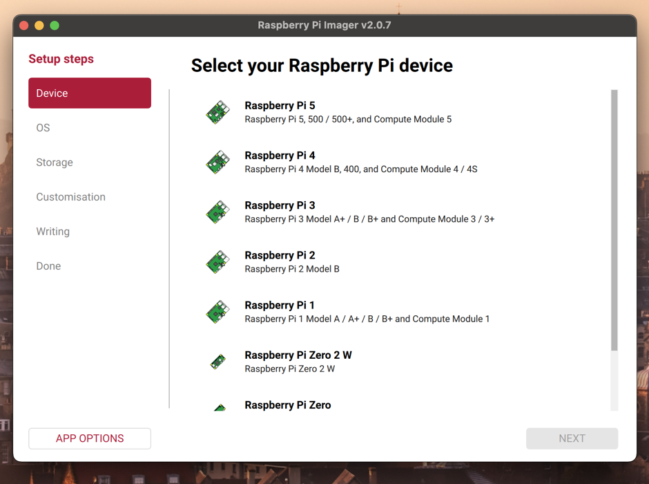
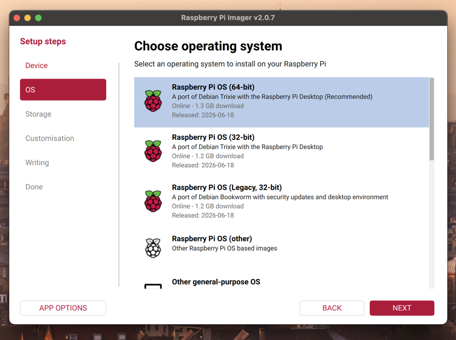
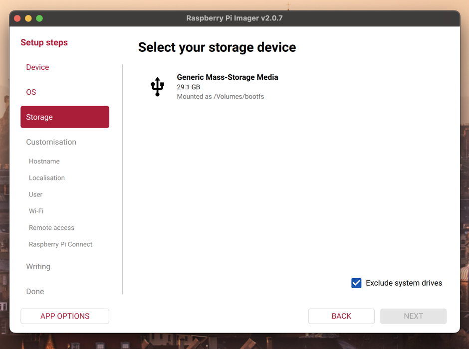
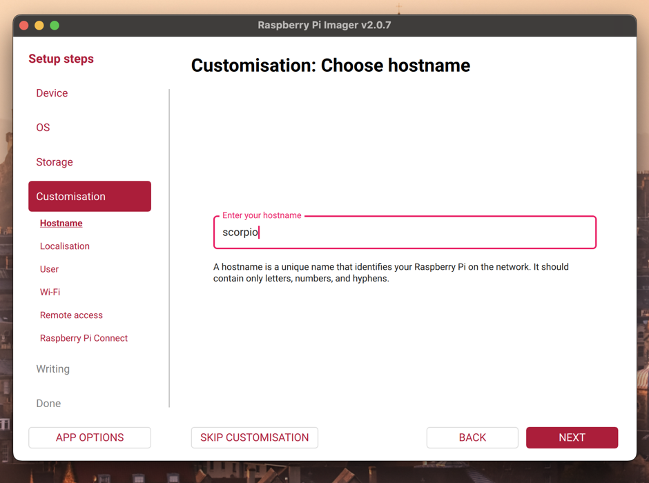
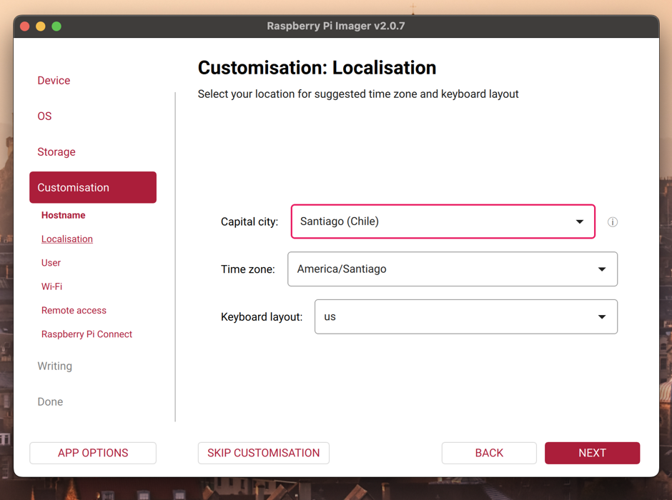
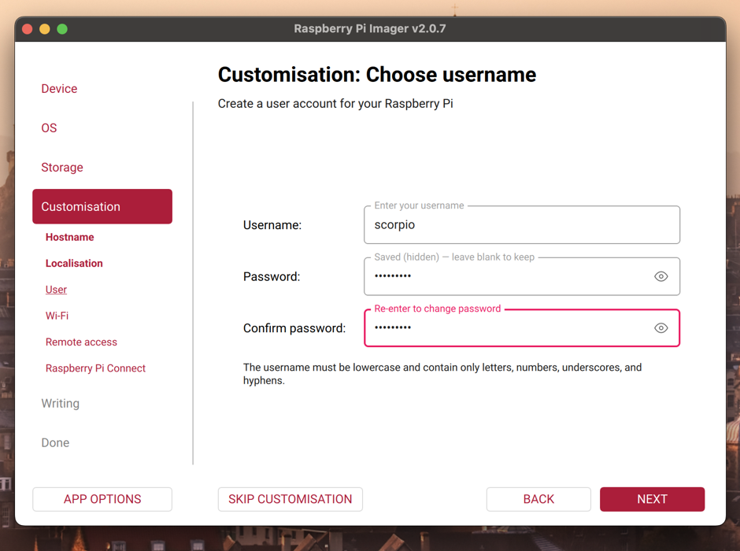
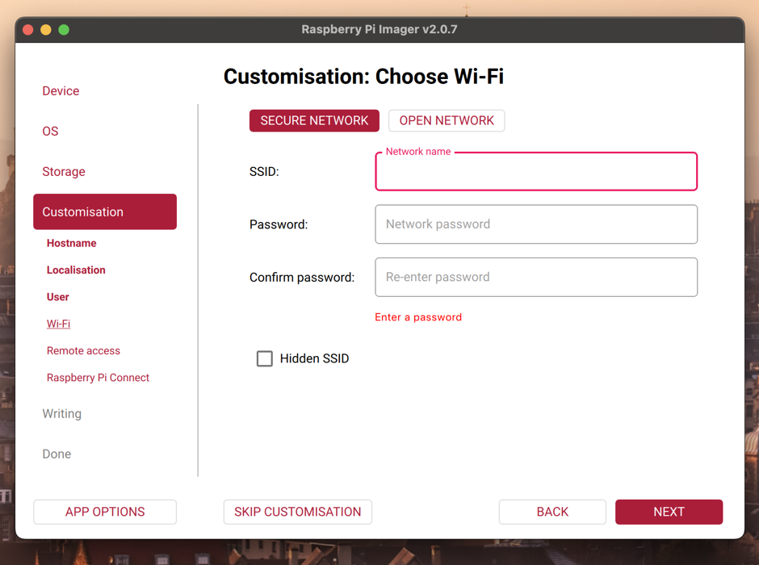
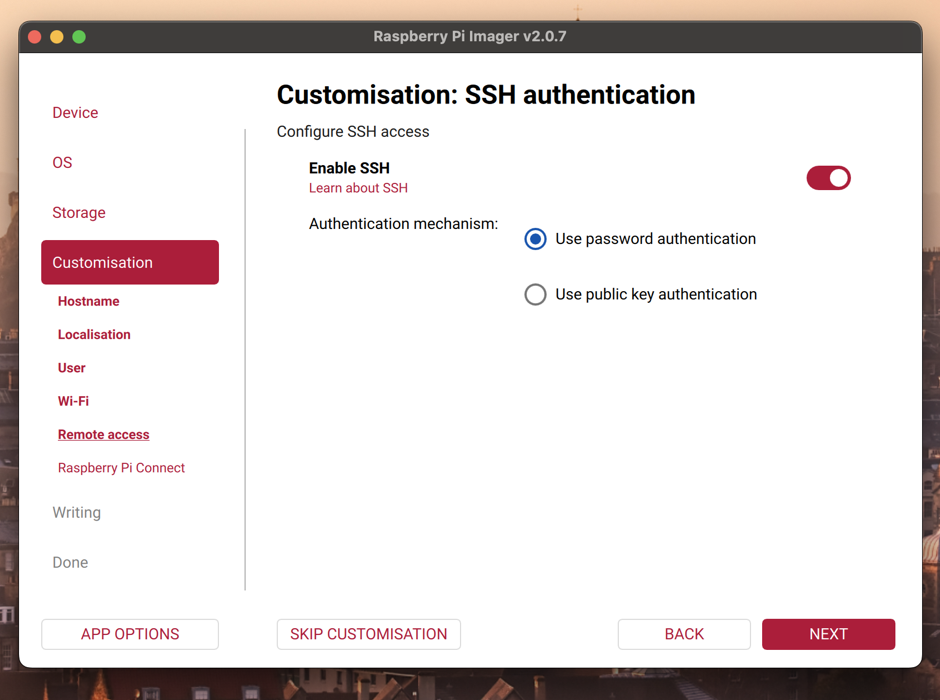
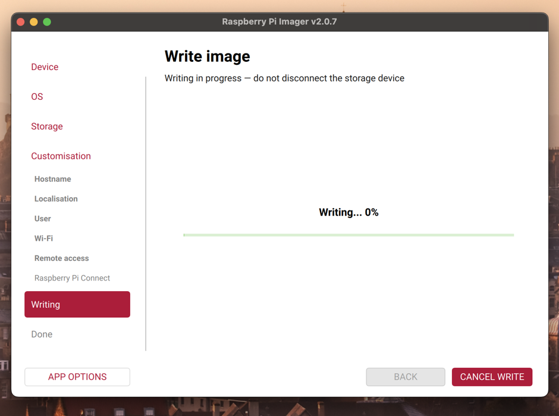

# 1. Instalación de Raspberry Pi OS y acceso local

[← Índice](README.md) | [Siguiente: instalación de Scorpio CLI →](page2.md)

## Requisitos

- Raspberry Pi compatible y fuente de alimentación.
- Tarjeta microSD o SSD.
- Computador con [Raspberry Pi Imager](https://www.raspberrypi.com/software/).
- Conexión a la misma red local que utilizará la Raspberry Pi.
- Antena, amplificador LNA y receptor SDR para el montaje final.

<figure>

<figcaption>Figura 1. Materiales necesarios para la instalación.</figcaption>
</figure>

## Preparar el medio de arranque

Abre Raspberry Pi Imager<sup>1</sup> y completa los siguientes pasos. Las imágenes utilizan una Raspberry Pi 4 como ejemplo.

### 1. Seleccionar la Raspberry Pi

Elige el modelo exacto que utilizarás.

<figure>

<figcaption>Figura 2. Selección del dispositivo.</figcaption>
</figure>

### 2. Seleccionar el sistema operativo

Selecciona **Raspberry Pi OS (64-bit)**.

<figure>

<figcaption>Figura 3. Selección del sistema operativo.</figcaption>
</figure>

### 3. Seleccionar el almacenamiento

Elige la microSD o el SSD donde se instalará el sistema.

> **Advertencia:** el proceso elimina todo el contenido de la unidad seleccionada. Verifica su nombre y capacidad antes de continuar.

<figure>

<figcaption>Figura 4. Selección del medio de almacenamiento.</figcaption>
</figure>

### 4. Definir el hostname

Utiliza un nombre fácil de reconocer, por ejemplo, `scorpio`. Si la red admite mDNS, después podrás acceder mediante `scorpio.local`.

<figure>

<figcaption>Figura 5. Configuración del hostname.</figcaption>
</figure>

### 5. Configurar la ubicación

Selecciona el país, la zona horaria y la distribución de teclado correspondientes.

<figure>

<figcaption>Figura 6. Configuración de localización.</figcaption>
</figure>

### 6. Crear el usuario

Define el usuario y una contraseña segura. Estas credenciales se utilizarán posteriormente para conectarse por SSH.

<figure>

<figcaption>Figura 7. Creación del usuario.</figcaption>
</figure>

### 7. Configurar Wi-Fi

Ingresa el nombre de la red, su contraseña y el país. 

<figure>

<figcaption>Figura 8. Configuración de Wi-Fi.</figcaption>
</figure>

### 8. Activar SSH

Activa **Enable SSH**. Para reproducir la configuración mostrada, selecciona la autenticación mediante contraseña.

<figure>

<figcaption>Figura 9. Configuración de acceso remoto por SSH.</figcaption>
</figure>

### 9. Escribir la imagen

Revisa la configuración y pulsa **Write**. Cuando finalice, retira la unidad de forma segura, insértala en la Raspberry Pi y enciéndela.

<figure>

<figcaption>Figura 10. Escritura del sistema operativo.</figcaption>
</figure>

<sup>1</sup> Recomendamos seguir directamente la guía oficial para [instalar y utilizar Raspberry Pi Imager](https://www.raspberrypi.com/documentation/computers/getting-started.html#imager-install).


## Montaje final

Conecta el SDR a un puerto USB de la Raspberry Pi y conecta la antena al SDR a través del amplificador LNA.

<figure>

<figcaption>Figura 11. Montaje físico final de la infraestructura.</figcaption>
</figure>


## Identificar la Raspberry Pi en la red local

Espera unos minutos mientras la Raspberry Pi inicia. El computador y la Raspberry Pi deben estar conectados a la misma red.

Primero intenta utilizar el hostname configurado:

```bash
ping scorpio.local
```

Detén el comando con `Ctrl+C`. Si responde, puedes conectarte directamente con `ssh scorpio@scorpio.local`.

Si el hostname no responde y ya conoces la IP, omite el escaneo. De lo contrario, instala `nmap` en tu computador y examina la subred local. Sustituye `192.168.1.0/24` si tu red utiliza otro rango.

En macOS:

```bash
brew install nmap
```

En Debian o Ubuntu:

```bash
sudo apt update
sudo apt install -y nmap
```

Ejecuta el escaneo:

```bash
sudo nmap -sn 192.168.1.0/24 | grep -B 2 -i "Raspberry"
```

Ejemplo de respuesta:

```text
Nmap scan report for 192.168.1.100
Host is up (0.018s latency).
MAC Address: DC:A6:32:XX:XX:XX (Raspberry Pi Trading)
```

El ping a la dirección de broadcast puede ayudar a actualizar la tabla de dispositivos de la red, pero no todos los equipos responden:

```bash
ping 192.168.1.255
```

## Conectarse por SSH

Utiliza el usuario creado en Raspberry Pi Imager y la IP obtenida:

```bash
ssh <usuario>@<direccion-ip>
```

Por ejemplo:

```bash
ssh scorpio@192.168.1.100
```

En la primera conexión, SSH solicitará confirmar la identidad del dispositivo. Comprueba la huella si está disponible, responde `yes` y escribe la contraseña configurada.
