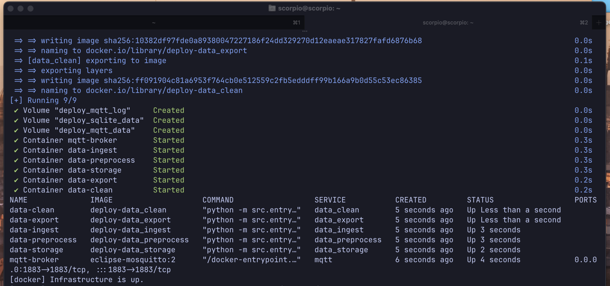

# 2. Instalación de Scorpio CLI

[← Anterior: acceso local](page1.md) | [Índice](README.md) | [Siguiente: Tailscale →](page3.md)

Esta etapa debe ejecutarse dentro de la Raspberry Pi, después de conectarse por SSH.

## Instalar Scorpio CLI

Los sistemas basados en Debian protegen el entorno Python del sistema. Por eso, Scorpio CLI debe instalarse con `pipx`, sin utilizar `sudo pip` ni `--break-system-packages`.

```bash
sudo apt update
sudo apt install -y pipx
pipx ensurepath
source ~/.profile
pipx install scorpio-cli
```

Una instalación correcta muestra un resultado similar al siguiente; las versiones pueden ser distintas:

```text
installed package scorpio-cli <version>, installed using Python <version>
These apps are now globally available
  - scorpio
done!
```

Si Scorpio CLI ya está instalado, actualízalo en lugar de volver a instalarlo:

```bash
pipx upgrade scorpio-cli
```

Comprueba que el comando esté disponible:

```bash
scorpio --help
```

## Instalar Scorpio

El siguiente paso es obligatorio. Scorpio CLI descarga la última versión compatible de Scorpio-Project, instala las dependencias de bajo nivel y configura la infraestructura Docker.

```bash
scorpio setup
```

El proceso puede tardar varios minutos. Finaliza correctamente cuando la terminal indica que la infraestructura está activa.

<figure>

<figcaption>Figura 1. Instalación de Scorpio e infraestructura Docker iniciada correctamente.</figcaption>
</figure>

No es necesario ejecutar `scorpio setup-docker` después de una instalación correcta mediante `scorpio setup`.

## Reiniciar y verificar

Reinicia la Raspberry Pi para aplicar los cambios de grupos, dispositivos y servicios:

```bash
sudo reboot
```

La conexión SSH se cerrará. Espera a que el equipo vuelva a iniciar, conéctate otra vez y verifica los servicios:

```bash
ssh <usuario>@<direccion-ip>
scorpio status
```

El reinicio también activa el permiso del usuario para comunicarse con Docker. Si se intenta ejecutar `scorpio status` antes del reinicio, puede aparecer `permission denied while trying to connect to the Docker daemon socket`.

## Referencia de comandos

```text
scorpio ui             Inicia la interfaz web de configuración
scorpio setup          Instala las dependencias y configura Docker
scorpio setup-host     Instala únicamente las dependencias del host
scorpio setup-docker   Configura únicamente la infraestructura Docker
scorpio start          Construye e inicia los servicios de Scorpio
scorpio stop           Detiene los servicios y conserva los datos
scorpio status         Muestra el estado de los servicios
scorpio logs           Sigue los registros de los servicios
scorpio build          Construye las imágenes Docker
scorpio reset          Detiene los servicios y elimina permanentemente sus datos
scorpio connect2db     Abre una conexión con la base de datos SQLite de Scorpio
```

Utiliza `scorpio --help` para ver la ayuda general. El comando `scorpio setup-docker` queda disponible para reinstalar o reparar únicamente la capa Docker; no forma parte del flujo normal descrito arriba.

`scorpio reset` elimina los volúmenes con los datos MQTT, los registros y la base de datos SQLite, por lo que exige una confirmación explícita.

## Actualizar o desinstalar Scorpio CLI

```bash
pipx upgrade scorpio-cli
pipx uninstall scorpio-cli
```
