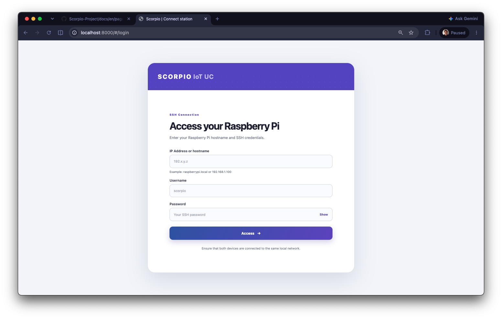
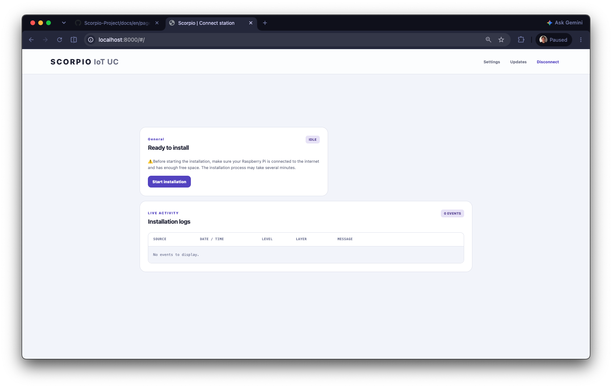
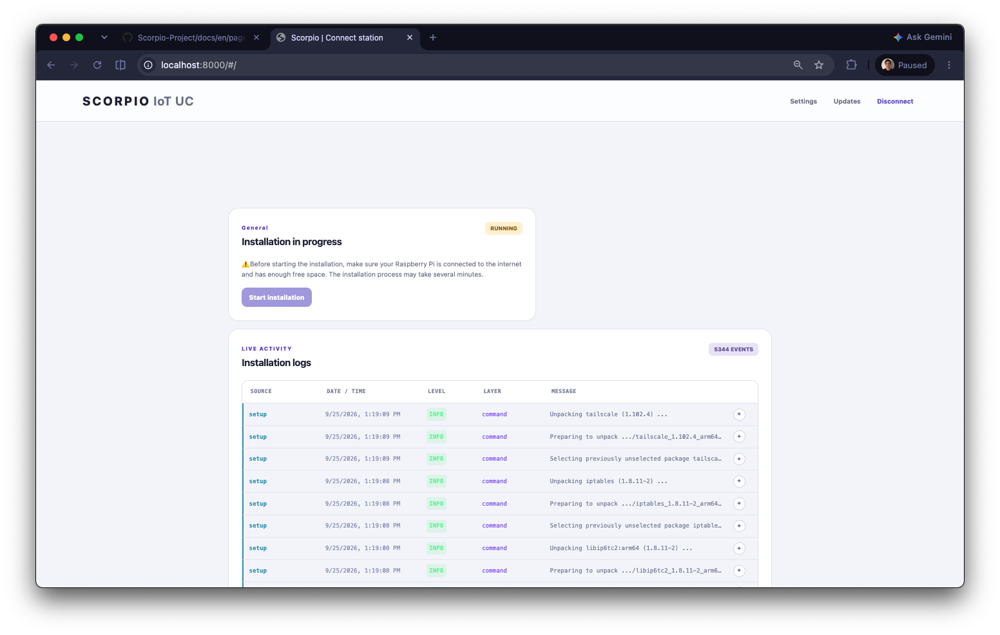
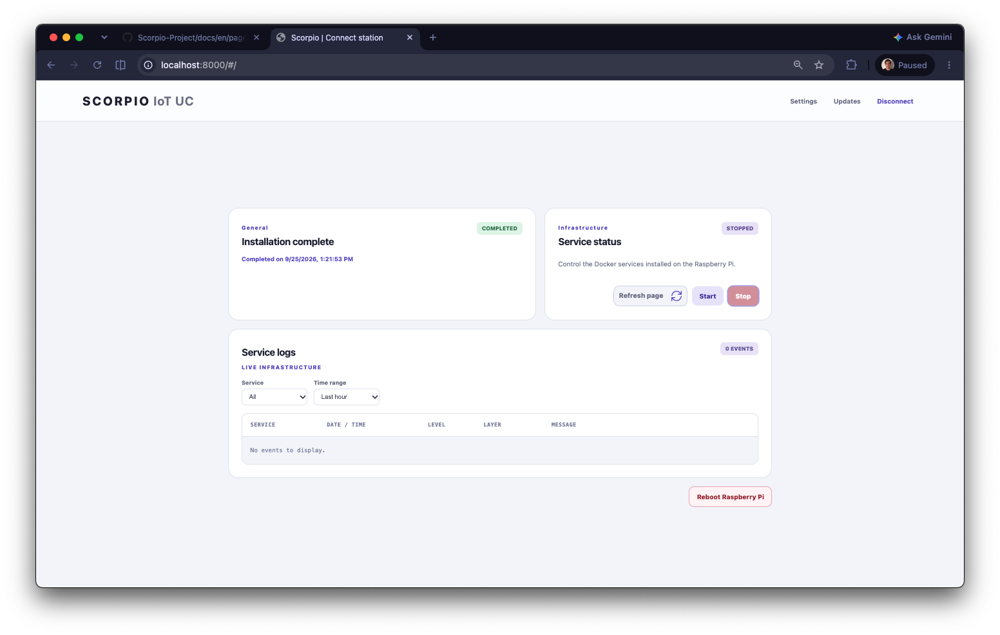
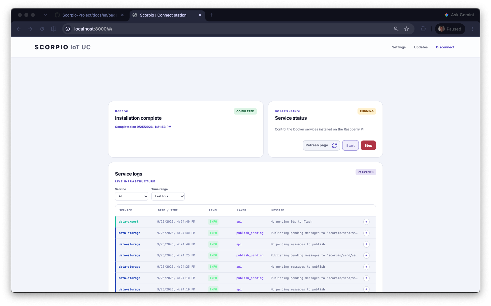
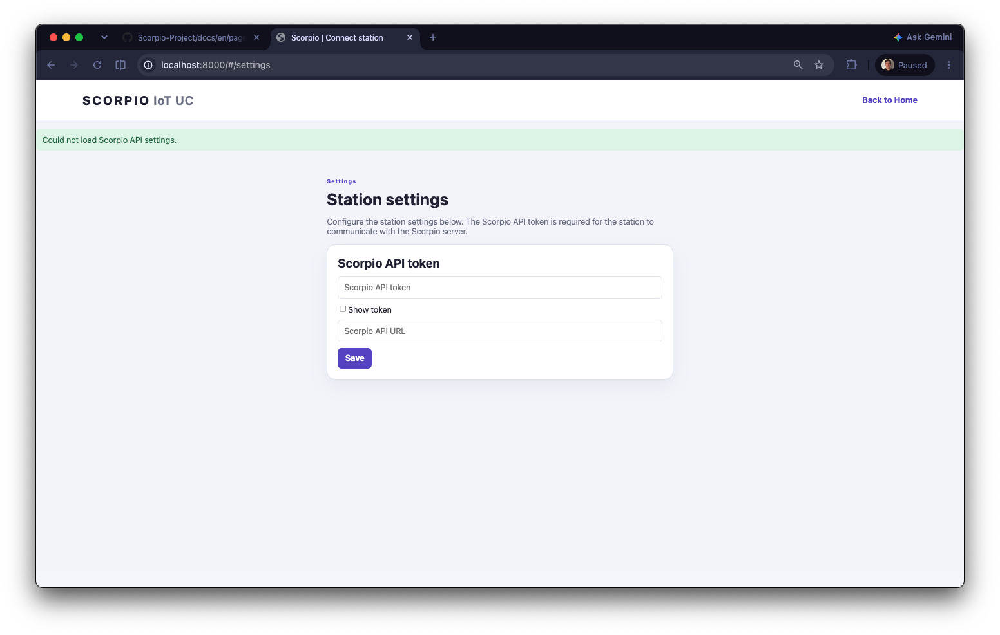
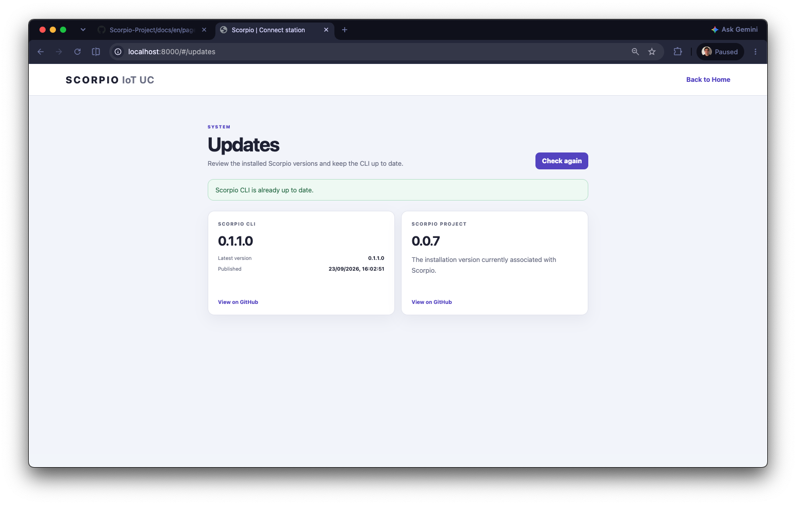
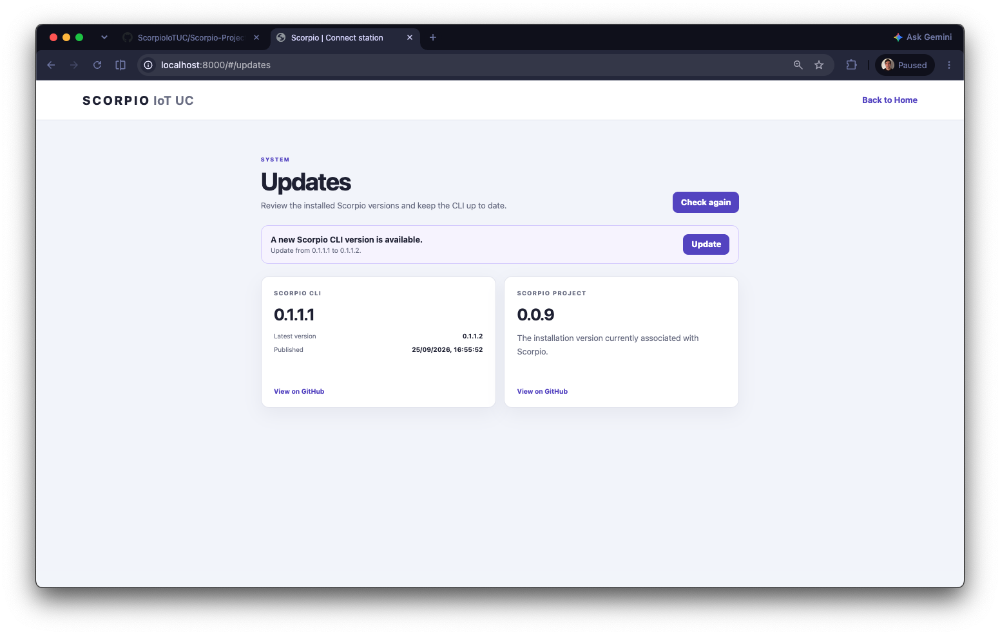

# 2. Instalación de Scorpio

[← Anterior: acceso local](page1.md) | [Índice](README.md) | [Siguiente: Tailscale →](page3.md)

> ⚠️ La interfaz web local todavía está en desarrollo. Si encuentras un error, repórtalo en [Issues](https://github.com/ScorpioIoTUC/Scorpio-Project/issues).

Scorpio puede instalarse desde la interfaz web —la opción recomendada— o directamente desde la terminal de la Raspberry Pi.

## Opción A: instalar mediante la interfaz web (recomendado)

En este método, Scorpio CLI se instala en el computador desde el que administrarás la Raspberry Pi. La UI se conecta por SSH y ejecuta la instalación en el dispositivo remoto.

### 1. Instalar Scorpio CLI

En macOS, crea un entorno virtual e instala Scorpio CLI con `pip` o `pip3`:

```bash
python3 -m venv .venv
source .venv/bin/activate
pip install scorpio-cli
# También puedes usar: pip3 install scorpio-cli
```

En Linux, se recomienda instalar `pipx` con el gestor de paquetes de la distribución:

```bash
sudo apt update
sudo apt install -y pipx
pipx ensurepath
pipx install scorpio-cli
```

En Windows PowerShell:

```powershell
py -m venv .venv
.\.venv\Scripts\Activate.ps1
python -m pip install scorpio-cli
```

Si Scorpio CLI ya está instalado, actualízalo según el método utilizado:

```bash
# macOS o entorno virtual
pip install --upgrade scorpio-cli
# También puedes usar: pip3 install --upgrade scorpio-cli

# Linux con pipx
pipx upgrade scorpio-cli
```

### 2. Abrir la interfaz y conectarse a la Raspberry Pi

Ejecuta:

```bash
scorpio ui
```

El terminal mostrará:

```text
INFO:root:Server started at http://localhost:8000
```

Abre [http://localhost:8000](http://localhost:8000) e ingresa los siguientes datos:

- **IP Address or hostname:** hostname o dirección IP de la Raspberry Pi, por ejemplo `scorpio.local` o `192.168.1.100`.
- **Username:** usuario creado en Raspberry Pi Imager, por ejemplo `scorpio`.
- **Password:** contraseña SSH de ese usuario.

El computador y la Raspberry Pi deben estar accesibles desde la misma red local o mediante Tailscale. Pulsa **Access** para iniciar la conexión SSH.

<figure>

<figcaption>Figura 1. Ingreso de las credenciales SSH de la Raspberry Pi.</figcaption>
</figure>

### 3. Iniciar la instalación

Después de conectarte aparecerá el panel principal con el estado **Ready to install**. Verifica que la Raspberry Pi tenga conexión a Internet y espacio disponible, y pulsa **Start installation**.

<figure>

<figcaption>Figura 2. Interfaz lista para iniciar la instalación.</figcaption>
</figure>

### 4. Supervisar el proceso de instalación

La interfaz descarga el último release de Scorpio-Project, instala las dependencias de bajo nivel y configura la infraestructura Docker. El proceso puede tardar varios minutos y genera una gran cantidad de eventos.

<figure>

<figcaption>Figura 3. Instalación en curso y eventos registrados en tiempo real.</figcaption>
</figure>

Mientras el estado sea **Running**, no cierres la interfaz ni apagues la Raspberry Pi. Puedes pulsar el botón `+` de un evento para ver su detalle. Si ocurre un problema, el estado cambiará a **Failed** y los últimos registros ayudarán a identificar la causa. Cuando termine correctamente, aparecerá **Installation complete** con el estado **Completed**.

### 5. Reiniciar la Raspberry Pi y administrar los servicios

Al finalizar, la tarjeta **Service status** muestra el estado de la infraestructura y habilita sus controles.

<figure>

<figcaption>Figura 4. Instalación completada y controles de la infraestructura disponibles.</figcaption>
</figure>

Pulsa **Reboot Raspberry Pi** para aplicar todos los cambios del sistema. La conexión SSH se cerrará temporalmente. Espera unos minutos, vuelve a abrir la interfaz e ingresa nuevamente las credenciales de acceso.

Los controles de servicio tienen las siguientes funciones:

- **Start:** inicia los servicios Docker de Scorpio.
- **Stop:** detiene los servicios sin eliminar los datos persistentes.
- **Refresh page:** vuelve a consultar el estado y reconecta la visualización de logs.
- **Reiniciar servicios:** pulsa **Stop**, espera a que el estado cambie a **Stopped** y luego pulsa **Start**.
- **Reboot Raspberry Pi:** reinicia el sistema operativo completo; no equivale a reiniciar solamente los servicios.

Cuando la infraestructura esté activa, el estado cambiará a **Running** y la sección **Service logs** mostrará los eventos de los contenedores. Puedes filtrar los registros por servicio y rango de tiempo.

<figure>

<figcaption>Figura 5. Servicios activos y logs de la infraestructura.</figcaption>
</figure>

### 6. Configurar la Station Key y la API

Después de completar la instalación, abre **Settings** desde la barra superior. En **Station settings**, configura la conexión utilizada para publicar los paquetes de Scorpio.

<figure>

<figcaption>Figura 6. Configuración de la Station Key y de la URL base de la API.</figcaption>
</figure>

Completa los campos con el siguiente formato. Para el entorno de producción, utiliza la URL base indicada:

```text
Station Key:
a121183c-1f93-4675-8a6c-58e075022db4.tmQ0fJwNGsMZYPJpoBTYZq_JE9X1LPqQotmquA7vAvY

Scorpio API URL:
https://scorpio.cpsrtc.cl/api/
```

> **Importante:** para completar esta configuración debes tener una Station Key activa. La clave se obtiene al crear la estación en la [plataforma de Scorpio](https://scorpio.cpsrtc.cl/). Copia y conserva la clave entregada durante ese proceso; el valor anterior se incluye únicamente como ejemplo de formato y no permite acceder a ninguna estación. No publiques una Station Key activa en documentación, repositorios, capturas ni mensajes.

En **Scorpio API URL**, ingresa la dirección actual de la API de producción: `https://scorpio.cpsrtc.cl/api/`. Pulsa **Save** para guardar la configuración; la interfaz actualizará el archivo `.env` de la Raspberry Pi y reiniciará automáticamente el servicio `data-export`.

Si aparece `Could not load Scorpio API settings` antes de instalar Scorpio, completa primero la instalación y vuelve a abrir **Settings**.

### 7. Revisar y aplicar actualizaciones

Abre **Updates** desde la barra superior para consultar las versiones instaladas de Scorpio CLI y Scorpio-Project. Si todo está actualizado, la interfaz mostrará **Scorpio CLI is already up to date**.

<figure>

<figcaption>Figura 7. Scorpio CLI y Scorpio-Project sin actualizaciones pendientes.</figcaption>
</figure>

Pulsa **Check again** para repetir la consulta. Si existe una versión nueva, aparecerá el botón **Update**.

<figure>

<figcaption>Figura 8. Ejemplo de una actualización disponible.</figcaption>
</figure>

Pulsa **Update** y mantén la ventana abierta hasta que finalice el proceso. Después, vuelve al panel principal y verifica que la infraestructura continúe en estado **Running**.

## Opción B: instalar desde la terminal

Conéctate por SSH a la Raspberry Pi e instala Scorpio CLI con `pipx`:

```bash
sudo apt update
sudo apt install -y pipx
pipx ensurepath
source ~/.profile
pipx install scorpio-cli
```

Si ya está instalado:

```bash
pipx upgrade scorpio-cli
```

Comprueba la instalación y ejecuta el setup:

```bash
scorpio --help
scorpio setup
```

El comando descarga el último release compatible, ejecuta `setup-host` y prepara Docker con `setup-docker`. Cuando termine, reinicia y verifica los servicios:

```bash
sudo reboot
# Después de volver a conectarte por SSH:
scorpio status
```

## Referencia de comandos

```text
scorpio ui             Inicia la interfaz web de configuración
scorpio setup          Instala las dependencias y configura Docker
scorpio setup-host     Instala únicamente las dependencias del host
scorpio setup-docker   Configura únicamente la infraestructura Docker
scorpio start          Construye e inicia los servicios de Scorpio
scorpio stop           Detiene los servicios y conserva los datos
scorpio status         Muestra el estado de los servicios
scorpio logs           Sigue los registros de los servicios
scorpio build          Construye las imágenes Docker
scorpio reset          Detiene los servicios y elimina permanentemente sus datos
scorpio connect2db     Abre una conexión con la base de datos SQLite de Scorpio
```

`scorpio reset` elimina los volúmenes con los datos MQTT, los registros y la base de datos SQLite, por lo que exige una confirmación explícita.

## Actualizar o desinstalar Scorpio CLI

```bash
# macOS o entorno virtual
pip install --upgrade scorpio-cli
pip uninstall scorpio-cli

# Linux con pipx
pipx upgrade scorpio-cli
pipx uninstall scorpio-cli
```
