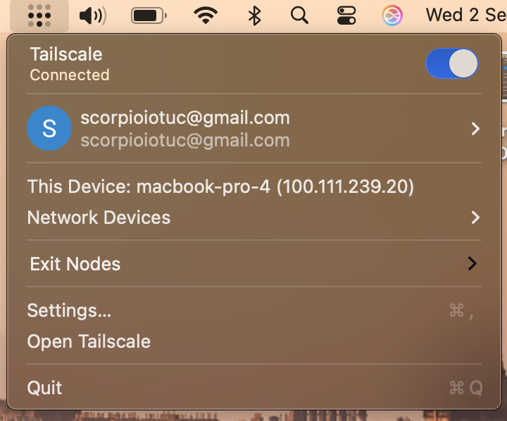

# 3. Configuración de acceso remoto con Tailscale

[← Anterior: Scorpio CLI](page2.md) | [Índice](README.md) | [Siguiente: Scorpio Developers →](page4.md)

Tailscale crea una red privada entre la Raspberry Pi y tus dispositivos. De esta forma puedes conectarte por SSH desde fuera de la red local sin abrir puertos en el router.

## Activar Tailscale en la Raspberry Pi

`scorpio setup` instala Tailscale e inicia su servicio. Verifica la instalación:

```bash
tailscale version
sudo systemctl status tailscaled
```

Pulsa `q` para salir de la vista del servicio. Después, vincula la Raspberry Pi con tu cuenta:

```bash
sudo tailscale up
```

El comando mostrará una URL de autenticación de un solo uso:

```text
To authenticate, visit:

    https://login.tailscale.com/a/...
```

Abre ese enlace, inicia sesión en Tailscale y autoriza el dispositivo. La terminal mostrará `Success.` cuando la vinculación termine.

## Obtener la IP de Tailscale

Consulta el estado y la dirección IPv4 asignada a la Raspberry Pi en su terminal:

```bash
tailscale status
tailscale ip -4
```

La dirección tendrá un formato similar a `100.x.y.z`. No utilices una IP de ejemplo como si fuera la dirección real del equipo.

## Preparar el computador cliente

Instala la [aplicación de Tailscale](https://tailscale.com/docs/install) en el computador desde el que te conectarás e inicia sesión con una cuenta que tenga acceso a la misma red de Tailscale.

Si la aplicación ya está instalada y conectada, no necesitas volver a instalar Tailscale ni ejecutar otro instalador desde la terminal.

## Conectarse por SSH mediante Tailscale

**Con Tailscale activo en ambos dispositivos**, ejecuta el siguiente comando desde el computador cliente:

```bash
ssh <usuario>@<ip-tailscale-raspberry>
```

Por ejemplo:

```bash
ssh scorpio@100.x.y.z
```

<figure>

<figcaption>Figura 1. Ejemplo de la aplicación Tailscale en Mac OS. Si quieres conectarte mediante Tailscale, esta debe estar siempre activa</figcaption>
</figure>


Una vez que la conexión SSH se establezca, puedes ejecutar comandos en la Raspberry Pi como si estuvieras frente a ella.

### Recomendación al usar Tailscale


Si el cliente tiene disponible el comando de Tailscale, puedes comprobar primero la comunicación:

```bash
tailscale ping <ip-tailscale-raspberry>
```

Ejecutar `tailscale ping` contra esa IP desde la propia Raspberry Pi mostrará `is local Tailscale IP`; esto es normal, pero no comprueba la conexión desde el computador cliente.

En la primera conexión SSH puede aparecer una advertencia sobre la autenticidad del host. Compara la huella mostrada con la huella de la Raspberry Pi:

```bash
sudo ssh-keygen -lf /etc/ssh/ssh_host_ed25519_key.pub
```

Si ambas coinciden, responde `yes`. Si la misma Raspberry Pi ya era conocida mediante su IP local, SSH también puede indicar que esa clave aparece asociada a otra dirección; esto es normal cuando el dispositivo es el mismo.
<!-- 
## Diagnóstico rápido

```bash
tailscale status
sudo systemctl restart tailscaled
sudo tailscale up
```

Si la Raspberry Pi no aparece en la aplicación, confirma que ambos dispositivos tengan conexión a Internet y pertenezcan a la misma red de Tailscale. -->
